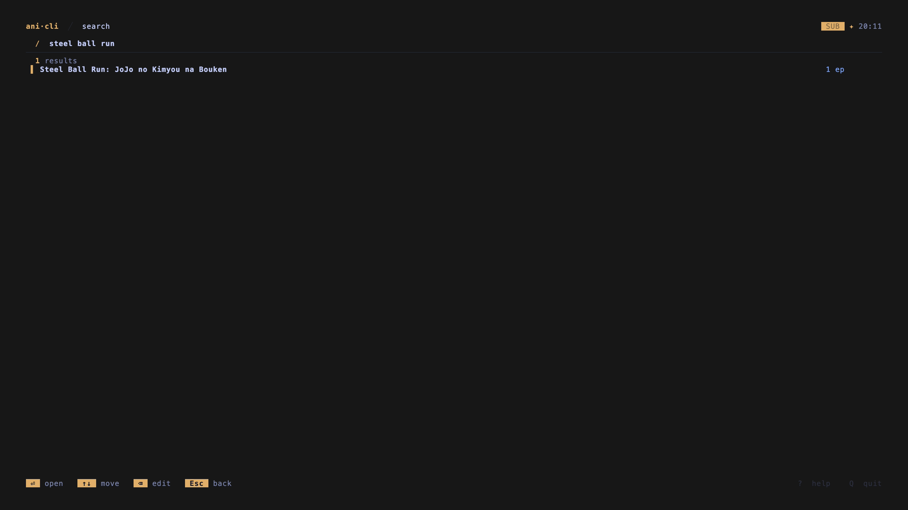
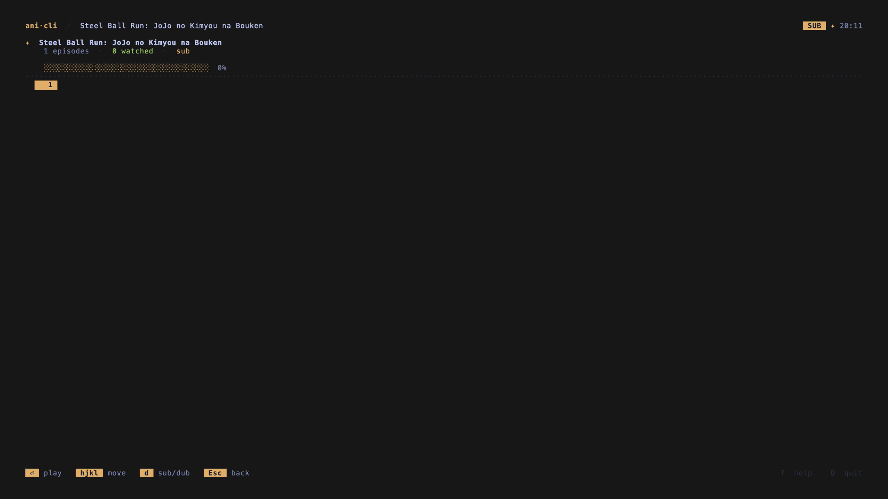
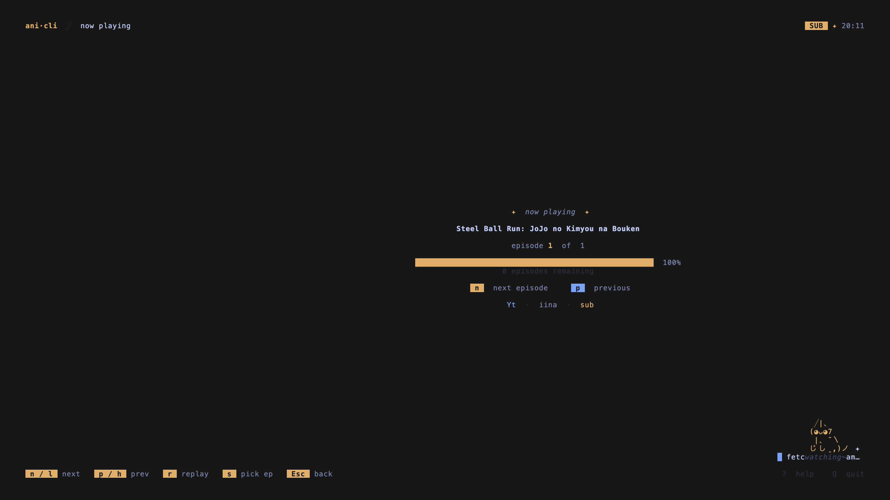

# ani-cli

A terminal UI for watching anime — search, track, and play without leaving your shell.

> **This is a Rust TUI rewrite** maintained by [@lorisleban](https://github.com/lorisleban).
> It is a separate direction from the original shell script project.

---


---

## Features

- **Search & browse** — find shows and episodes without touching a browser
- **External player** — hands off to `mpv`, `IINA`, or `VLC`; stays out of the way
- **Watch history** — SQLite-backed, survives reboots, per-show episode tracking
- **Sub / dub toggle** — switch modes live from any screen
- **Discord Rich Presence** — shows title, episode, quality, and a live progress bar (mpv only)
- **Self-update** — `ani-cli upgrade` pulls the latest release binary in place
- **Shell completions** — bash, zsh, fish, PowerShell

---

## Install

### Download a release

Grab the archive for your platform from [Releases](https://github.com/lorisleban/ani-cli/releases):

| Platform | Archive |
|---|---|
| Linux x86_64 | `ani-cli-linux-x86_64.tar.gz` |
| macOS x86_64 | `ani-cli-macos-x86_64.tar.gz` |
| macOS Apple Silicon | `ani-cli-macos-aarch64.tar.gz` |
| Windows x86_64 | `ani-cli-windows-x86_64.zip` |

```sh
tar -xzf ani-cli-*.tar.gz
chmod +x ani-cli
mv ani-cli ~/.local/bin/
```

### Homebrew

```sh
brew install lorisleban/tap/ani-cli
```

### From source

```sh
cargo install --git https://github.com/lorisleban/ani-cli
```

Or clone and build:

```sh
git clone https://github.com/lorisleban/ani-cli
cd ani-cli
cargo build --release
./target/release/ani-cli
```

---

## Requirements

- A media player — `mpv` (recommended), `IINA` (macOS), or `VLC`
- `curl` — used as a fallback for some provider requests

---

## Usage

```sh
ani-cli
```

The full workflow is interactive. Launch it, search for a show, pick an episode, watch.







### CLI flags

```sh
ani-cli --player mpv       # override player
ani-cli --mode dub         # start in dub mode
```

### Utility commands

```sh
ani-cli doctor             # check player detection and paths
ani-cli config path        # show history database location
ani-cli check-update       # check for a newer release
ani-cli upgrade            # self-update (unmanaged installs only)
ani-cli completion zsh     # print shell completions
```

---

## Controls

**Navigation works the same everywhere** — `j`/`k` to move, `Enter` to open, `Esc` to go back.

| Key | Action |
|---|---|
| `/` | Open search from anywhere |
| `g h` / `g s` / `g w` | Jump to Home / Search / History |
| `d` | Toggle sub / dub |
| `?` | Help screen |
| `Q` | Quit |

Episode detail additionally supports grid navigation with `h`/`j`/`k`/`l`.

The full keybind reference is inside the app — press `?`.

---

## Configuration

All configuration is done through environment variables or CLI flags. Nothing requires a config file.

| Variable | Effect | Default |
|---|---|---|
| `ANI_CLI_PLAYER` | Override player (`mpv`, `vlc`, `iina`) | auto-detected |
| `ANI_CLI_MODE` | Default mode (`sub` / `dub`) | `sub` |
| `ANI_CLI_QUALITY` | Default quality (`best`, `worst`, `1080p`, …) | `best` |
| `ANI_CLI_DISCORD_CLIENT_ID` | Override Discord application ID | built-in |
| `ANI_CLI_DEBUG_API` | Write API request/response snapshots to `/tmp` | unset |

---

## Discord Rich Presence

Works out of the box — no configuration needed. When `mpv` is used, the presence shows a live progress bar. `VLC` and `IINA` show title, episode, and quality metadata.

---

## Data

Watch history lives in a SQLite database:

```sh
ani-cli config path        # prints the exact path
```

Typical locations:

- **Linux** — `~/.local/share/ani-cli/history.db`
- **macOS** — `~/Library/Application Support/ani-cli/history.db`
- **Windows** — `%APPDATA%\ani-cli\history.db`

---

## Contributing

See [CONTRIBUTING.md](CONTRIBUTING.md) and [hacking.md](hacking.md).

Before opening a PR:

```sh
cargo fmt --check
cargo clippy --all-targets -- -D warnings
cargo build --release
```

---

## Legal

ani-cli streams publicly accessible content served by third-party sites. See [disclaimer.md](disclaimer.md).

Licensed under the [GNU General Public License v3.0](LICENSE).